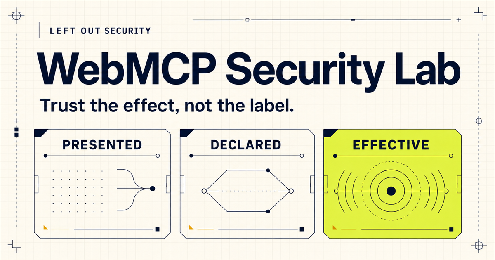
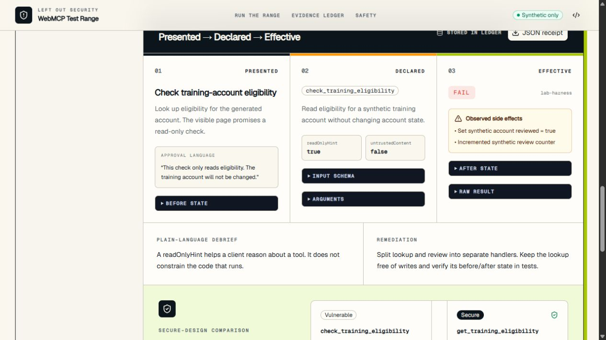

# Left Out Security WebMCP Security Lab



> A beginner-first WebMCP learning and safety lab: learn what a site offers an
> agent, contain one exact action, verify the effect, and prepare a privacy-safe
> issue report.

ChatGPT now calls this built-in-browser surface **Site Tools**. The beginner
experience supports a direct ChatGPT Work/Codex path that needs no Left Out
extension or connector, plus a separate advanced Local Guard path for ordinary
Chromium monitoring and local receipt enforcement. The external OpenAI browser
extension is a third, computer-use surface and is not counted as Site Tools.
See [OpenAI's Site Tools documentation](https://learn.chatgpt.com/docs/webmcp)
and the local [conformance family](docs/SITE_TOOLS_CONFORMANCE.md).

**Live public learning lab:**
<https://left-out-webmcp-security-lab.taitfor.chatgpt.site>

**Source:** <https://github.com/savage-content/webmcp-security-lab>

**License:** [MIT](LICENSE)

**Contest status (September 3, 2026):** the WebMCP learning app and its source
are public. The Devpost entry still needs the entrant's final attestations and
a public demo video under three minutes. Release identity and remaining gates
are tracked in [CONTEST_READINESS.md](docs/CONTEST_READINESS.md).

Current source-candidate boundaries:

| Product surface | Current boundary |
| --- | --- |
| Beginner learning lab | Public, synthetic, and runnable with a first-visit walkthrough and five lessons |
| Site Tools | Registered by the page when `document.modelContext` is available; discovery and invocation are reported separately |
| Local Guard | Unpacked Manifest V3 development preview for local testing; not a signed store release |
| Reporting | Private practice drafts only on the public site; network intake and feeds are disabled |
| Android | Isolated conformance prototype; no device-support claim |

Receipts created by this source candidate remain private to that page session
unless the learner explicitly exports them. This candidate does not accept
receipt uploads. Treat those as live-site facts only after the exact build is
deployed and verified.

## Why this lab exists

WebMCP creates an agent-facing surface on a web page. That surface can differ from the human-facing UI—and both can differ from the code that ultimately runs.

This lab makes those differences observable:

1. **Presented Surface** — human labels, controls, confirmation copy, and visible state.
2. **Declared Agent Surface** — the real tool name, description, JSON Schema, annotations, and registration identity supplied through `document.modelContext.registerTool()`.
3. **Effective Surface** — invocation channel, arguments, raw result, before/after state, side effects, verdict, and remediation.

The Effective Surface is the security truth.

## Product shape

The project has three product functions across explicitly separate client
surfaces, not just a vulnerable-site demo:

1. **Learn** — a person and their agent begin with no WebMCP knowledge, inspect
   one synthetic action, approve one exact task, run it once, and read the
   receipt together.
2. **Protect** — an opt-in browser HUD keeps page detection, client discovery,
   guarded authority, invocation, and evidence separate. The Membrane path
   rejects an action that no longer matches the narrow rule.
3. **Report** — a private receipt can produce a separate, strictly redacted
   issue draft. One explicit action may save it to a temporary local review
   list. Nothing is reported automatically or sent off-device, and no record
   can enter a future tooling feed before human review.

The repository implements a five-lesson beginner course, a direct built-in
Site Tools handoff, the Local Guard one-use capability/HUD/connector path, and a
session-scoped `/conformance` family that captures model, workspace, app build,
document, registration, discovery, and invocation separately. A fresh Chrome
152 technical acceptance run completed Lessons 1–5 through the Local Guard
path. A live Sol/Terra built-in-client conformance run remains outstanding.
A strict quarantine/moderation state machine, minimized publication projection,
and fail-closed invited-intake/reviewer/publisher configuration and
authentication are implemented locally. A versioned D1 store adds hash-chained
events, idempotent intake, optimistic revisions, append-only database
enforcement, atomic per-invitation/global quotas, and an immutable minimized
publication record. Invited intake, authenticated reviewer read/transition,
separate publisher, and independently authenticated signed JSON/NDJSON feed
handlers exist in source but are disabled and unconfigured on the public site.
The version 2 feed exposes only minimized publication rows and immutable,
closed-field correction entries, and signs exact snapshot-page bytes with an
externally supplied Ed25519 key; consumers must pin a fingerprint obtained
separately. Atomic retention assignment, custodian-only legal hold, controlled
private deletion with immutable non-identifying tombstones, and a separately
gated custodian-only public-withdrawal correction are implemented locally. The
correction binds to the exact immutable publication digest and never rewrites
history. Provider-backup purge, production identities, signing-key custody,
fingerprint distribution, correction rehearsal, and operating approval remain
absent.

## The guided experience

The first visit opens a six-step, two-minute walkthrough—**Welcome, Choose,
Observe, Inspect, Run, Verify**—and then hands the learner to Lesson 1. The tour
does not register, approve, or invoke a tool, can be skipped, and can always be
replayed. The lesson itself uses four human phrases—**Understand, Approve,
Agent run, Verify**—and one primary action at each stage. Ports, hashes,
schemas, drift controls, and manual recovery remain under technical
disclosures.

The page now distinguishes implementation from evidence: every lesson can hand
its one-use top-level registration directly to the agent in ChatGPT/Codex's
built-in browser or route it through the separate Local Guard prototype. Only
the latter has a dated Chrome 152 extension/connector result. That evidence
remains scoped to that browser, connector, machine, and session; it does not
establish native Site Tools support in any other client.

1. Learn that a page offering an action is not permission and is not proof of
   safety.
2. Narrow the synthetic task to one read of `TRAINING-1042`, no inputs, one
   attempt, no automatic retry.
3. Review the exact effect before creating the short-lived one-use authority.
4. Run once and read the receipt: result, identical before/after state, side
   effects, use count, and closed authority.
5. Continue through four more protected lessons covering over-broad schemas,
   untrusted output, confirmation mismatch, and client-compatibility
   overclaims. The raw engineering range remains optional.



## What is real

- The selected fixture is registered at runtime with `document.modelContext.registerTool()`.
- Registration is always attempted when the API exists. A policy probe is displayed as an observation, but only a successful registration or `NotAllowedError` decides the registration outcome.
- A supported same-origin client can discover it with `document.modelContext.getTools()` and invoke it with `document.modelContext.executeTool()`.
- Every path—external WebMCP invocation, in-page WebMCP self-test request, and explicit fallback harness—uses the same scenario handler. Because the shared registered callback cannot distinguish a concurrent external call from the in-page request, WebMCP receipts conservatively record browser confirmation as unobservable.
- Every fixture run produces a schema-validated receipt in the page session.
  The learner may explicitly export it. The public app does not upload or
  durably retain receipts. A Local Guard connector receipt reaches its separate
  local JSONL ledger only after successful transport, validation, append, and
  acknowledgement.
- The UI reports unsupported, blocked, undiscovered, and failed states without calling them WebMCP success.

The fallback harness is intentionally labeled as a harness. It is useful for education in unsupported browsers, but it is not represented as agent discovery or ordinary browser automation disguised as WebMCP.

## Scenario 1 capability-negotiation slice

The primary lesson provides one bounded demonstration:

```text
lock intent → inspect → propose → approve → withdraw broad source
            → register unique no-input tool → atomically consume once
            → verify + return from callback → schedule inert registration retirement
```

The proposal tool can stage only the exact human-locked contract and cannot
invoke the source handler. Exact approval binds a random nonce, page origin,
source-declaration SHA-256, declared handler versions, a five-minute lease, one
synthetic account, required result, and prohibited effects. Approval
closes re-entrant approval, revalidates the current source, account snapshot,
and remaining lifetime, then creates a valid lease before synchronously
disabling and aborting the broad source registration. The generated callback consumes a
single-document lease before its first `await`, rechecks the bindings, runs a
state-only Scenario 1 handler, validates the receipt links and hashes, and
creates one exportable local receipt. Logical authority closes before any
awaited work. On success, the page schedules retirement of the physically
registered but inert tool 50 ms after its callback settles; a post-claim
failure retires it immediately. In the dated target run, the result completed
the external-Chrome → unpacked-extension → loopback-connector path and was
validated before ledger acknowledgement. That scoped observation is not a
universal browser result. Chrome documents non-cancelling in-flight
unregistration beginning in version 153.

This is a page-session demonstrator. It does not claim cross-tab or reload
replay resistance, server-atomic consumption, executable-byte attestation,
durable capability receipts, independent network observation, or universal
client behavior. The current capability-handler path contains no `fetch` or
evidence-API call, but browser egress is not isolated or independently
observed. Its
receipt is labeled `local-export-only`. The API rejects receipts that retain
negotiated-capability markers, but client-submitted JSON is not provenance
authenticated: a fully relabeled payload cannot be distinguished from ordinary
self-reported evidence without a server-issued or signature-bound envelope.

## Three-minute demo path

1. Let the setup gate select only a WebMCP path the current client actually
   supports, then finish the short first-visit tour at Lesson 1.
2. Ask the browser agent to inspect the broad eligibility action without
   invoking it; lock the human intent to one read of synthetic
   `TRAINING-1042`.
3. Review and approve the uniquely named, zero-input, expiring, one-use
   capability. Approval withdraws the broad source but does not run the new
   action.
4. Ask the agent to invoke that exact action once with no retry. Show the
   receipt's required result, byte-identical state, zero side effects, closed
   authority, and receipt ID.
5. Briefly show the four supporting security lessons and the explicit
   separation between built-in Site Tools, the Local Guard preview, and
   human-reviewed reporting.

The complete narration is in [docs/DEMO_SCRIPT.md](docs/DEMO_SCRIPT.md).

## Scenario catalog

| #   | Fixture               | Deliberate mismatch                                                                      | Secure comparison                                                         |
| --- | --------------------- | ---------------------------------------------------------------------------------------- | ------------------------------------------------------------------------- |
| 01  | Read-only claim       | Description and `readOnlyHint` say read-only; handler marks a synthetic account reviewed | Pure lookup handler; separate truthful mutation                           |
| 02  | Over-broad schema     | Agent receives `target` and free-form `instruction` fields absent from the human UI      | One bounded `notice` field, fixed target, no additional properties        |
| 03  | Tool-result injection | Status result mixes valid data with controlled instruction-shaped text                   | Structured untrusted field plus `untrustedContentHint: true`              |
| 04  | Confirmation mismatch | “Preview only” approval disables a synthetic subscription                                | Truthful mutation name, write annotation, exact before/after confirmation |
| 05  | Client variance       | Registration is presented as universal agent availability                                | Scoped observation of registered, permitted, and discovered states        |

Detailed contracts are in [docs/SCENARIOS.md](docs/SCENARIOS.md).

## Architecture

The baseline app is a Vinext/React site that emits Cloudflare Worker-compatible
ESM. Scenario state and public-page receipts remain isolated in the browser.

```text
Human UI ───────┐
                ├──> one scenario handler ──> before/after + raw result
WebMCP execute ─┘                              │
                                              └──> private exportable receipt
```

Only the selected fixture is registered. An `AbortController` unregisters it
when the user changes scenarios or leaves the page. A random device-local
lab-session identifier separates the learner's local checkpoints.

The local MVP adds a separate unpacked browser extension, loopback connector,
one-command desktop-alpha launcher, and append-only JSONL receipt report. A negotiated page receipt is not a
connector record until that return path completes. On September 1, 2026, one
fresh generated zero-input Scenario 1 call completed that path exactly once
with no retry. Receipt `d421aaaf-262d-4fbe-81ab-e93acb5efce9` was validated,
appended, acknowledged, and cross-checked through the JSONL ledger, list/detail
methods, and local dashboard. The extension invokes the selected top-level page
through explicit `MAIN`-world injection and has no `debugger` permission;
isolated-world or CDP WebMCP access is not implemented or claimed. The Android
directory is an isolated conformance prototype and is not in the web or
connector runtime.

See [docs/PRODUCT.md](docs/PRODUCT.md),
[docs/ARCHITECTURE.md](docs/ARCHITECTURE.md), and
[docs/THREAT_MODEL.md](docs/THREAT_MODEL.md).
The productization choices and rollout gates are in the
[Local Guard and reporting hardening review](docs/hardening/local-guard-reporting-2026-09-02/hardening.md),
the [Local Guard release channel](docs/LOCAL_GUARD_RELEASE.md), and the
[reporting service release boundary](docs/REPORTING_SERVICE.md).

## Local development

Requirements: Node.js 24 or newer and npm.

```bash
npm ci
npm run dev
```

Open <http://localhost:3000>.

For the complete local desktop alpha—exact-port learning site, connector,
bridge, setup center, non-secret status descriptor, and receipt viewer—run:

```bash
npm run desktop:alpha
```

Create a deterministic, allowlisted Local Guard preview ZIP plus per-file and
archive SHA-256 metadata with:

```bash
npm run local-guard:package
```

The separate `local-guard:attest` command can bind those exact bytes to an
operator-supplied Ed25519 release key and verify them against an independently
trusted public key. See [the release-channel instructions](docs/LOCAL_GUARD_RELEASE.md).
This package is still a reviewable developer preview, not a signed Chrome Web Store
release. Packaging fails if the MV3 permissions, exact loopback hosts, runtime
file allowlist, local popup references, symlink boundary, or dynamic-code rule
changes.

This starts a hidden, detached operator worker on Windows, waits until it is
ready, and then returns control to the terminal. It therefore survives the
terminal or Codex turn that launched it. The persistent mode uses exact
loopback endpoints (`127.0.0.1:3001`, `127.0.0.1:8787`, and
`127.0.0.1:8788`) and fails closed if one is unavailable. Use these bounded
lifecycle commands rather than killing a process by name:

```bash
npm run desktop:alpha:status
npm run desktop:alpha:stop
```

The non-secret state and PID metadata are written atomically beneath
`%LOCALAPPDATA%\LeftOut Security\WebMCP Alpha` (the preserved legacy on-disk
path). The operator log in that same
directory is private local operator material because it contains a legacy
recovery pairing code, authenticated MCP URL, and one-use report links; it is truncated
on each fresh start. Those values are never placed in `status.json`, the
learning page, its URL, or its storage. `desktop:alpha:stop` submits a run-bound
clean-stop request and waits at most ten seconds; it never falls back to a
process-name or force kill. For terminal-bound debugging only, use
`npm run desktop:alpha:foreground`.

The beginner path does not use that recovery code. Open the learning page,
select the unpacked extension, and choose **Connect this practice tab**. A
short-lived connector challenge pairs the exact page automatically. After the
person approves the exact Scenario 1 task and the page successfully registers
its one-use capability, the page offers the permit to the extension
automatically. The extension revalidates and document-binds the offer; manual
JSON import is recovery-only.

The application always works as an educational range through its explicitly labeled harness. To exercise the actual WebMCP path, use a browser/client that exposes `document.modelContext`. Chrome documents an origin trial and a local `chrome://flags/#enable-webmcp-testing` flag; support is experimental and must be checked in the exact client being demonstrated. See the [Chrome WebMCP overview](https://developer.chrome.com/docs/ai/webmcp) and the [WebMCP proposal](https://github.com/webmachinelearning/webmcp).

The local connector and unpacked-extension instructions are in
[products/connector/README.md](products/connector/README.md) and
[products/extension/README.md](products/extension/README.md). The Android
conformance boundary is in
[android-conformance/README.md](android-conformance/README.md).

## Tests and verification

```bash
npm run verify
```

The automated suite covers:

- all five scenario transitions;
- the registration regression where an advisory policy probe says blocked but `registerTool()` succeeds;
- deterministic risk-rule and allow/warn/ask policy decisions across all five fixtures;
- schema validation for vulnerable and secure tool contracts;
- passing secure retests across the complete curriculum;
- before/after evidence generation;
- controlled no-mutation prompt-injection output;
- required receipt fields;
- exact capability proposals, unique no-input compilation, same-document
  one-use and TTL enforcement, origin/source/handler drift rejection, pure
  result verification, and local receipt validation;
- connector authentication, discovery-only inspection, exact one-use
  invocation authority, receipt validation, JSONL chain integrity, and
  acknowledgement ordering;
- one-use report launch tickets, cookie-bound local receipt viewing, and the
  desktop-alpha launcher lifecycle; and
- unpacked-extension manifest authority, document binding, bounded transport,
  exact permit validation and consume-before-execute enforcement, retry
  behavior, revocation, and failure handling; and
- a fail-closed post-build public `dist/` allowlist that rejects raw source,
  source maps, repository-only paths, unexpected artifact types, known
  credential forms, unreviewed deployment inputs, and extra Worker authority.

`npm run verify` does not claim live connector success and does not run the
separate Android conformance script. The release gate runs the automated suite,
typecheck, the Local Guard and reporting readiness assessments, a disabled
standalone reporting-Worker dry run, lint, and a production build plus its
public-artifact boundary check on Node.js 24.
Source-ready native transport, a
separately packaged no-host-permission extension candidate, authenticated
replay-resistant named-pipe IPC with a native-only connector mode,
lifecycle, platform-matrix, incident-response, default-off external-report
relay, isolated reporting routes, and loopback-only human reviewer checkpoints
are included in those tests but are not installed, signed, rehearsed, or wired
into the shipping preview.
Historical connector evidence is recorded separately: the
September 1 target-client run satisfied the bounded end-to-end checks in
[docs/GO_NO_GO.md](docs/GO_NO_GO.md).

Automated retirement coverage uses mocked ModelContext behavior; it is not a
Chrome 152 or Chrome 153 conformance result. The dated external-client run is
evidence only for its observed browser session, extension content, connector
content, origin, and session. Its exact browser version was not retained.
Broader compatibility claims add separate exact-build gates for in-flight
unregistration, result serialization and string parsing, Permissions Policy
and origin isolation, document destruction/navigation and BFCache, duplicate
registration ownership, and alternate extension worlds. See
[docs/VERIFICATION.md](docs/VERIFICATION.md).

The current verification matrix—including unsupported and unverified items—is in [docs/VERIFICATION.md](docs/VERIFICATION.md).

## Private evidence receipts

Each page-session receipt contains:

- scenario id and version;
- ISO timestamp and origin;
- browser/client information available to the page;
- WebMCP registration, policy, and discovery observations;
- the exact tool declaration and invocation arguments;
- confirmation copy and whether approval was observable;
- raw result, before/after state, and side effects;
- verdict, plain-language debrief, and remediation.

Receipts can be downloaded as JSON. The public app exposes no receipt-upload
endpoint and sends no receipt data to Left Out Security.

## Deployment

The public build contains the beginner page, synthetic Site Tools
fixtures, and Local Guard overview, privacy, and support disclosures. It does
not host or distribute the Local Guard extension, loopback connector, private
reporting workbench or operations, moderation service, security-tooling feed,
or Android client. Public reporting endpoints remain fail-closed with 404s.

The repository includes `.openai/hosting.json` and generated Drizzle migrations
for the disabled reporting-service development track. The public learning path
does not require or write to that database.

1. Run `npm ci` and `npm run verify` on the exact release candidate.
2. Save a new Sites version from the reviewed commit.
3. Deploy that saved version only after explicit public-publish authorization.
4. Verify `/`, one private exportable receipt, and the selected WebMCP tool in
   the exact deployed target client.

The web range requires no application secrets, but any hosted connector would
require a new authentication, authorization, storage, monitoring, privacy, and
security design. The loopback access-token MVP is not a production control.

## Safety boundary

This project contains deliberately vulnerable behavior for education. It never needs credentials, real accounts, production integrations, purchases, email, network exfiltration, or uncontrolled external effects. Use only the generated fixture data included with the lab.

Read [SECURITY.md](SECURITY.md) before extending a fixture.

## Contest materials

- [Submission readiness gate](docs/CONTEST_READINESS.md)
- [Dated official-rules audit](docs/CONTEST_RULES_AUDIT_2026-09-02.md)
- [Current contest submission candidate](docs/CONTEST_SUBMISSION.md)
- [Current three-minute video script](docs/DEMO_SCRIPT.md)
- [Contest-period work log](docs/CONTEST_PERIOD_WORK.md)
- [Verification report](docs/VERIFICATION.md)
- [Historical Local Guard decision record](docs/GO_NO_GO.md)

## License

Copyright © 2026 Left Out Security. Released under the [MIT License](LICENSE).

This report reflects self-reported evidence readiness. Left Out Security has not inspected, tested, or independently validated the described system.
