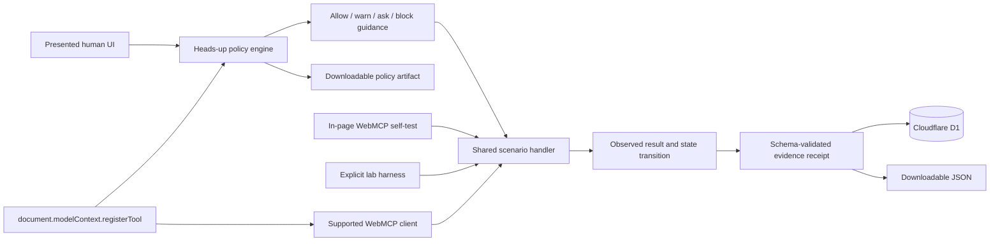

# Architecture and implementation plan

## Product goal

The lab lets a human and an agent act on the same page while preserving enough evidence to compare three security surfaces. It is a working range, not a JSON mockup or remote MCP server.

## System shape



## Trust boundaries

1. **Human presentation boundary** — text, controls, and approval copy may be inaccurate in a vulnerable fixture.
2. **WebMCP declaration boundary** — name, description, schema, and annotations describe a capability but do not enforce handler behavior.
3. **Execution boundary** — the shared scenario engine is the only place fixture state changes.
4. **Persistence boundary** — the API validates and appends complete receipts to D1. It exposes no mutation or deletion path.
5. **Client-observation boundary** — browser API support, registration, permissions policy, discovery, and invocation are recorded separately. External client behavior is not inferred when the page cannot observe it, and a fallback receipt never counts as WebMCP invocation. The shared registered callback cannot distinguish the page's approved `executeTool()` request from a competing client invocation, so it never upgrades browser confirmation to known.
6. **Awareness-policy boundary** — deterministic rules explain why a declaration deserves allow, warn, or ask treatment. They provide guidance and do not replace browser enforcement or professional validation.
7. **Negotiated-capability boundary** — the Scenario 1 working slice replaces the broad registration only within one document session. A synchronous generation gate and `AbortController` invalidate cached source handles; a monotonic in-memory lease makes one same-realm claim before any awaited work. This is not a cross-tab or server-atomic grant.
8. **Capability-evidence boundary** — negotiated-capability receipts are created locally after the state-only handler is verified. They are exportable, non-durable, and not independently attested. The ordinary D1 endpoint rejects receipts that retain negotiated-capability markers; because client JSON is not provenance-authenticated, a caller that relabels every marker cannot be distinguished from ordinary self-reported evidence. The current handler path contains no evidence POST, but browser egress is not isolated or independently observed.

## Scenario 1 negotiated lifecycle

```mermaid
sequenceDiagram
  participant H as Human
  participant A as Agent
  participant P as Page
  participant W as document.modelContext

  H->>P: Lock exact intent
  P->>W: Register proposal-only tool
  A->>P: Stage exact structured proposal
  P-->>H: Source hash + contract + effects
  H->>P: Exact approval
  P->>P: Revalidate source, state, expiry; create valid lease
  P->>P: Disable source generation
  P->>W: Abort source + proposal registrations
  P->>W: Register unique no-input capability
  A->>W: Invoke once with {}
  P->>P: Claim monotonic lease; abort capability
  P->>P: Recheck origin/source/version bindings
  P->>P: Run state-only Scenario 1 handler
  P->>P: Verify result + byte-identical state
  P-->>H: Local export-only linked receipt
```

The final contract hash covers the complete generated identity and declaration, intent, proposal/source references, approval copy and nonce, declared handler versions, and lifetime. The nested source fingerprint covers the source declaration, origin, and declared source-handler version; neither hash attests executable bytes. A random approval nonce makes otherwise identical approvals compile to different tool names. The broad callback also checks a synchronous registration generation, so a client holding an old tool object receives a rejection after withdrawal even if it can still call the cached JavaScript callback.

## Scenario contract

Every `ScenarioDefinition` includes:

- stable id, ordinal, semantic version, category, and risk label;
- Presented Surface copy and confirmation language;
- the vulnerable `ToolDeclaration` registered on the page;
- a secure comparison declaration;
- generated initial state and bounded default arguments;
- exact secure-retest approval scope;
- expected finding, debrief, remediation, and secure-design explanation.

The pure `runScenario()` function receives the scenario id, current state, arguments, and run context. It returns immutable before/after snapshots, a raw serializable result, explicit side effects, a verdict, and remediation. Verdicts are derived from scenario-specific invariants; selecting a secure fixture does not mechanically produce `PASS`.

## Registration lifecycle

The client feature-detects `document.modelContext`. For the selected scenario it calls:

```ts
await document.modelContext.registerTool(tool, {
  signal: controller.signal,
});
```

The callback delegates to the same scenario engine used by the fallback harness. Only the registered callback marks WebMCP invocation as observed. Aborting the controller when the scenario changes removes the old registration. No `navigator.modelContext` alias is used.

The app may also display `document.permissionsPolicy.allowsFeature('tools')`, but that enumeration is advisory because behavior has varied in experimental clients. It never short-circuits registration. A resolved `registerTool()` call proves registration and permission for that document; a thrown `NotAllowedError` proves policy denial. Browser support, registration, policy, discovery, and invocation remain separate states.

## Shared risk and policy engine

The same deterministic engine that powers the human heads-up emits extension-ready policy artifacts. It currently evaluates five bounded rules:

- `WMC-001` — read-only annotation conflicts with a known state change;
- `WMC-002` — declared schema exceeds the human-visible capability;
- `WMC-003` — instruction-shaped output is not marked untrusted;
- `WMC-004` — approval language does not describe the effective write; and
- `WMC-005` — registration is generalized into universal client support.

Meaningful mismatches map to `ask`, scoped support uncertainty maps to `warn`, and aligned controlled contracts may map to `allow`. `block` is reserved in the artifact vocabulary for future user policy; the current educational range does not silently block a page tool.

## Evidence data model

The downloadable receipt is the canonical evidence record. D1 stores the complete serialized receipt plus indexed columns for id, lab session, scenario, timestamp, invocation channel, and verdict.

Secure builder retests run the narrowed declaration against a fresh synthetic fixture and produce a distinct `secure-retest` receipt. A retest receives `PASS` only when its declaration, arguments, approval evidence, state transition, result, and side effects satisfy that scenario’s invariants. Every generated receipt and policy artifact carries the required self-reported-readiness limitation.

Indexes match the actual read patterns:

- session + timestamp for the current ledger;
- scenario + timestamp for scenario analysis; and
- timestamp for operational inspection.

`PRAGMA optimize` runs after runtime schema initialization. Generated migrations remain in source control.

## Session model

Fixture state is held in memory and is resettable. A random UUID in browser storage identifies the device-local lab ledger; it does not authorize any account or hold product data. Evidence remains authoritative in D1 and survives page reloads. Ledger requests must provide the same UUID in `X-Lab-Session`, and the receipt must match it.

## Delivery phases

1. Architecture, contracts, and visual system.
2. Functional range, real registration, five scenario handlers, and D1 evidence API.
3. Tests, migrations, safety documentation, CI, and verification.
4. Submission copy, screenshots, demo script, public source, and deployment.
