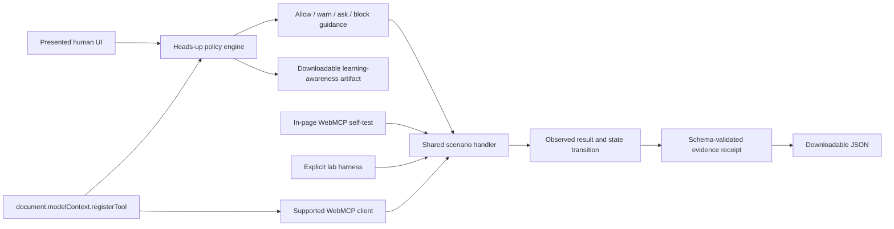
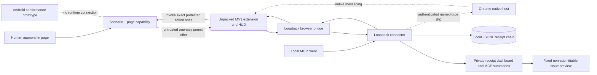

# Architecture and implementation plan

## Product goal

The product teaches a first-time human and agent what WebMCP offers, protects
one exact approved action through a browser-owned Membrane, and turns verified
local evidence into a privacy-minimized issue preview. The public application
contains the setup gate, walkthrough, five fixtures, and Local Guard disclosure
pages, while reporting APIs remain fail-closed. The Local Guard extension, connector,
moderation operations, reporting workbench, and isolated Android conformance
prototype remain undeployed.

## Three client surfaces

The product keeps three execution surfaces explicit:

1. **ChatGPT Site Tools** — the built-in browser in ChatGPT Work or Codex
   discovers top-level JavaScript registrations and invokes them under the
   client's normal safety review. Model, workspace, page registration,
   discovery, and invocation are captured separately. No Left Out extension or
   connector is required for this native path.
2. **Agent browser context** — OpenAI's external browser extension performs
   ordinary browser interaction. Its browser actions are not Site Tools
   discovery or invocation.
3. **Left Out Local Guard** — the `0.3.0` unpacked extension and loopback
   connector are an independent Membrane prototype for one selected Chromium
   document. A separate deterministic `0.4.0` source candidate replaces
   browser loopback authority with Chrome native messaging and authenticated
   connector IPC. Its HUD, permit enforcement, and local receipt chain attest
   only calls routed through the selected path; neither package is a signed
   ordinary-user release.

The official client boundary and current top-level-only support are documented
in [OpenAI's Site Tools documentation](https://learn.chatgpt.com/docs/webmcp).
The separate computer-use surface is documented in
[OpenAI's browser extension documentation](https://learn.chatgpt.com/docs/chrome-extension).
The advanced `/conformance` route implements the scoped test family described
in [SITE_TOOLS_CONFORMANCE.md](SITE_TOOLS_CONFORMANCE.md).

## System shape



That diagram is the public browser boundary. The local MVP adds a
separate path. The solid route is the shipping developer preview; the dashed
route is a source-ready native candidate that disables the browser HTTP bridge
when selected:



The page-side receipt and connector record are distinct evidence states. A
page `PASS` does not become connector evidence until the return path succeeds,
the connector validates and appends the receipt, and acknowledgement completes.
Two earlier 2026-09-01 attempts produced page-side `PASS` receipts
`31cac0df-4849-42cc-8f44-05a6bdacd9ea` and
`fe3d952f-db38-463c-9023-3d36f51bf863`, but both failed before connector
commitment. The latter is consistent with Chrome 152 cancelling an in-flight
call when its registration signal is aborted, but no retained browser trace
proves that cause. A subsequent fresh no-retry run completed the full path as
receipt `d421aaaf-262d-4fbe-81ab-e93acb5efce9`: state was byte identical,
side effects were empty, the one-use lease was consumed, the connector
committed one hash-chained entry, and post-run discovery returned zero tools.
This is dated single-session evidence, not a universal compatibility claim.

## Trust boundaries

1. **Human presentation boundary** — text, controls, and approval copy may be inaccurate in a vulnerable fixture.
2. **WebMCP declaration boundary** — name, description, schema, and annotations describe a capability but do not enforce handler behavior, authority, or actor identity.
3. **Execution boundary** — the shared scenario engine is the only place fixture state changes.
4. **Public receipt privacy boundary** — page receipts remain in memory and are
   retained only when the learner explicitly exports them. The public app has
   no receipt-upload endpoint.
5. **Client-observation boundary** — browser API support, registration, permissions policy, discovery, and invocation are recorded separately. External client behavior is not inferred when the page cannot observe it, and a fallback receipt never counts as WebMCP invocation. The shared registered callback cannot distinguish the page's approved `executeTool()` request from a competing client invocation, so it never upgrades browser confirmation to known.
6. **Awareness-policy boundary** — deterministic rules explain why a declaration deserves allow, warn, or ask treatment. They provide guidance and do not replace browser enforcement or professional validation.
7. **Negotiated-capability boundary** — each built-in lesson can replace its broad registration within one document session with a uniquely named, closed, zero-input capability. V1 retains Lesson 1's byte-identical read contract; V2 freezes the exact profile, arguments, source, baseline, permitted effect, and prohibited effects for Lessons 2–5. A synchronous generation gate invalidates cached handles, and a monotonic in-memory lease atomically closes logical authority before any awaited work. After the page callback settles successfully, the now-inert capability registration is scheduled for retirement through its `AbortController` after a 50 ms Chrome 152 compatibility delay; post-claim failure retires it immediately. The timer does not observe browser/client delivery. Chrome documents non-cancelling in-flight unregistration beginning in version 153. This is not a cross-tab or server-atomic grant.
8. **Capability-evidence boundary** — negotiated-capability receipts are created locally only after the profile-specific handler result and effect are verified. Lesson 1 receipts are local-export-only; Lessons 2–5 return their v2 receipt to the caller for connector validation and local ledger commitment. Neither form is independently attested. The public application accepts no receipt upload. Browser egress is not isolated or independently observed.
9. **Connector boundary** — the connector is a loopback-only, token-protected
   development process. It may append a returned capability receipt to a local
   JSONL chain only after schema, identity, chronology, state, and hash
   validation. One completed live return path now confirms that ordering for
   the observed session; it does not establish crash-atomic or production
   durability.
10. **Extension boundary** — the Manifest V3 extension is a local transport
    adapter bound to one explicitly selected top-level document. Its WebMCP
    calls are injected into that page's `MAIN` world, and neither manifest has
    `debugger` permission. The shipping developer preview has exact loopback
    host permissions; the separate source candidate instead declares
    `nativeMessaging`, has no host permissions, and routes the closed
    pair/poll/result/revoke/report-link lifecycle through the native client.
    Isolated-world ModelContext access and the experimental CDP WebMCP domain
    are alternate, unimplemented adapter surfaces. The extension is not an
    approval surface, signed package, store release, or public deployment.
11. **Android boundary** — the Android directory shares protocol concepts but
    has no runtime connection to the web page or connector. Its JVM and API-36
    checks do not establish generated AppFunction metadata or device behavior.

## Generated capability lifecycle

```mermaid
sequenceDiagram
  participant H as Human
  participant A as Agent
  participant P as Page
  participant W as document.modelContext

  H->>P: Lock exact intent
  P->>W: Register proposal-only tool
  A->>P: Stage exact structured proposal
  P-->>H: Source hash + contract + effects
  H->>P: Exact approval
  P->>P: Revalidate source, state, expiry; create valid lease
  P->>P: Disable source generation
  P->>W: Abort source + proposal registrations
  P->>W: Register unique no-input capability
  A->>W: Invoke once with {}
  P->>P: Atomically consume lease; close logical authority
  P->>P: Recheck origin/source/version bindings
  P->>P: Run the fixed, versioned lesson handler
  P->>P: Verify exact result + approved state/effect boundary
  P->>P: Return verified result + linked receipt from callback
  Note over P,W: Start 50 ms compatibility timer after callback settles
  P->>W: Retire registration through AbortSignal
  P-->>A: Return linked receipt for connector validation
  A-->>H: Show verified local receipt/report draft
```

The final contract hash covers the complete generated identity and declaration, intent, proposal/source references, approval copy and nonce, declared handler versions, and lifetime. V2 additionally binds the built-in profile, approved arguments, baseline hash, and exact effect allow/deny lists. The nested source fingerprint covers the source declaration, origin, and declared source-handler version; neither hash attests executable bytes. A random approval nonce makes otherwise identical approvals compile to different tool names. The broad callback also checks a synchronous registration generation, so a client holding an old tool object receives a rejection after withdrawal even if it can still call the cached JavaScript callback.

## Scenario contract

Every `ScenarioDefinition` includes:

- stable id, ordinal, semantic version, category, and risk label;
- Presented Surface copy and confirmation language;
- the vulnerable `ToolDeclaration` registered on the page;
- a secure comparison declaration;
- generated initial state and bounded default arguments;
- exact secure-retest approval scope;
- expected finding, debrief, remediation, and secure-design explanation.

The pure `runScenario()` function receives the scenario id, current state, arguments, and run context. It returns immutable before/after snapshots, a raw serializable result, explicit side effects, a verdict, and remediation. Verdicts are derived from scenario-specific invariants; selecting a secure fixture does not mechanically produce `PASS`.

## Registration lifecycle

The client feature-detects `document.modelContext`. For the selected scenario it calls:

```ts
await document.modelContext.registerTool(tool, {
  signal: controller.signal,
});
```

The callback delegates to the same scenario engine used by the fallback harness. Only the registered callback marks WebMCP invocation as observed. Aborting the controller when the scenario changes removes the old registration. No `navigator.modelContext` alias is used.

The app may also display `document.permissionsPolicy.allowsFeature('tools')`, but that enumeration is advisory because behavior has varied in experimental clients. It never short-circuits registration. A resolved imperative `registerTool()` call proves registration and permission for that document; a thrown `NotAllowedError` proves imperative policy denial. Declarative registration can silently return when the policy is disabled and is outside this lab path. Browser support, registration, policy, discovery, and invocation remain separate states.

## Browser-platform conformance boundary

The page/connector architecture does not absorb experimental browser behavior
into its security claims. Chrome 153's documented non-cancelling unregister,
string result contract, serialization rejection, permissions-policy and
origin-keyed-agent-cluster gates, document destruction, navigation, BFCache,
and duplicate-name ownership all require exact-build tests before a broader
compatibility statement. The next gate is specified in
[VERIFICATION.md](VERIFICATION.md).

Current upstream status also bounds architectural scope: declarative
sandboxing and document-destruction notifications have open Chromium issues;
browser actor-stack interaction is not used for approval; and raw CDP WebMCP
does not establish `chrome.debugger` access. The implemented adapter remains
top-level `MAIN`-world injection with no debugger permission. Annotations are
transported hints only, and the connector treats every returned receipt as
untrusted input requiring strict parsing and validation.

## Shared risk and policy engine

The same deterministic engine that powers the human heads-up emits learning-only awareness artifacts. These artifacts explain risk but are not extension authority. After exact approval and successful generated-capability registration, the page may offer a self-hashed capability permit through a one-way page-to-extension handoff. V1 is accepted only for Lesson 1. V2 must contain a closed, extension-known lesson profile plus the exact task arguments, baseline, and effect restrictions. The extension treats either page-supplied envelope as untrusted narrowing data, revalidates it, and binds it to the exact tab, browser document, bridge session, origin, path, declaration, contract, expiry, and single use. Manual export and import remain recovery-only. The engine currently evaluates five bounded rules:

- `WMC-001` — read-only annotation conflicts with a known state change;
- `WMC-002` — declared schema exceeds the human-visible capability;
- `WMC-003` — instruction-shaped output is not marked untrusted;
- `WMC-004` — approval language does not describe the effective write; and
- `WMC-005` — registration is generalized into universal client support.

Meaningful mismatches map to `ask`, scoped support uncertainty maps to `warn`, and aligned controlled contracts may map to `allow`. `block` is reserved in the artifact vocabulary for future user policy; the current educational range does not silently block a page tool.

## Evidence data model

For public scenarios, the downloadable receipt is the learner-controlled
evidence record. It remains in the page session unless explicitly exported.
Negotiated receipts are also `local-export-only` at the page. Their
`capability.invalidation` timestamp records when the lease ceased granting
authority; it does not attest when the browser physically removed the
registration. When the page callback produces a successful result, the receipt
therefore records the registration as present; neither callback settlement nor
the later timer attests that a browser/client received the result. Fresh
post-delay discovery must observe physical retirement separately. The local
connector maintains a separate JSONL report
only after successful return
transport and validation; the two stores must not be conflated.

Secure builder retests run the narrowed declaration against a fresh synthetic fixture and produce a distinct `secure-retest` receipt. A retest receives `PASS` only when its declaration, arguments, approval evidence, state transition, result, and side effects satisfy that scenario’s invariants. Every generated receipt and learning-awareness artifact carries the required self-reported-readiness limitation.

## Reporting privacy boundary

Private page receipts and the issue-reporting model are separate. The current local
issue page is a scriptless preview of a fixed, typed, redacted synthetic draft;
it has no form, submit control, issue store, or outbound network action. Local
and synthetic observations are never submittable. A future public path would
require explicit consent, quarantine, human review, and a separately minimized
publication record before any JSON or NDJSON security-tooling feed. Raw
receipts, page text, paths, queries, screenshots, tool strings, result strings,
permits, conversations, and reporter identifiers are not feed fields.

The local productization candidate adds a pure moderation state machine. A
strict public-web draft begins in `quarantined`, can reach `published` only
through `under_review` and `accepted_private`, and must then pass the separate
hostname-consent and evidence-basis projection gate. A separate D1 boundary
persists versioned snapshots plus immutable, hash-chained events; idempotency
and optimistic revisions reject replay and stale writers. The checked-in
migrations enforce the same state, digest, append-only, retention, and quota
gates as the runtime bootstrap. A strict non-browser, bearer-invited intake
route exists in source and always writes to quarantine, but its configuration
is absent on the public site so it returns `404`. Authenticated reviewer
routes use keyset pagination and permit only the closed transition graph;
caller-supplied actor, timestamp, publication, or state authority is rejected.
A separate loopback-only reviewer process calls those routes server-side. Its
scriptless browser surface receives only an HttpOnly local session plus opaque,
short-lived view, pagination, and revision-bound action tokens. The reviewer
bearer and private report IDs never enter browser URLs; complete ledger detail
is revalidated before actions are offered. Each transition action is consumed
before one no-retry request, and the client rejects publication authority.
This source-ready workbench is not served by the public application and is not
evidence of production identity or operator rehearsal.
A separately authenticated publisher can act only on the exact
`accepted_private` revision, re-run the hostname/evidence gate, and atomically
write an immutable minimized publication row. Stored or caller-supplied state
is not treated as authenticated human review. When its independent lifecycle
gate is enabled, intake atomically persists an immutable retention assignment
and a distinct custodian can set or clear legal hold through a narrow,
idempotent revision transition. That custodian can authorize an exact private
deletion against the current retention revision. The deletion transaction
blocks legal holds, enforces the stored deadline for retention-expiry requests,
writes an immutable non-identifying tombstone, removes the private moderation
and retention chains plus their lookup state, and removes its transient
authorization. Public publication rows are keyed by a public event ID in a
separate table; deleting private data removes only the private mapping, so the
minimized public projection remains available without a private report ID.
A separately gated custodian-only route can append one immutable `withdraw`
correction against the exact digest of a public publication. Its action and
reason vocabularies are closed, idempotent replay is exact, a second withdrawal
is rejected, and neither the publication nor its correction can be updated or
deleted. Provider-backup purge does not yet exist, and correction operations
have not been rehearsed. An independently authenticated feed handler reads the
immutable publication and correction tables as a bounded, stable version 2
timeline; its JSON and NDJSON forms omit private report IDs, operator identities,
source revisions, and private origins. Exact response bytes carry an Ed25519
detached signature, content digest, key ID, public key, and fingerprint. The
signing key is supplied outside source, and consumers must pin the public-key
fingerprint through a separately trusted channel rather than trust the response
header.

## Session model

Fixture state is held in memory and is resettable. A random UUID in browser
storage identifies the learner's local journey checkpoint; it does not
authorize any account or hold product data. Page receipts do not survive reload
unless explicitly exported. Connector JSONL reports follow the separate local
boundary above.

## Delivery phases

1. Architecture, contracts, and visual system.
2. Functional range, real registration, five scenario handlers, and private
   exportable receipts.
3. Tests, migrations, safety documentation, CI, and verification.
4. Frozen version 1 submission copy, screenshots, demo script, public source,
   and deployment. The current MVP remains a separate local technical
   candidate; public release and deployment remain blocked under
   `docs/GO_NO_GO.md`.
