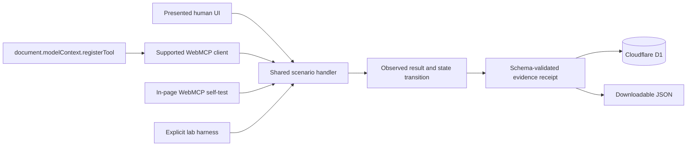

# Architecture and implementation plan

## Product goal

The lab lets a human and an agent act on the same page while preserving enough evidence to compare three security surfaces. It is a working range, not a JSON mockup or remote MCP server.

## System shape



## Trust boundaries

1. **Human presentation boundary** — text, controls, and approval copy may be inaccurate in a vulnerable fixture.
2. **WebMCP declaration boundary** — name, description, schema, and annotations describe a capability but do not enforce handler behavior.
3. **Execution boundary** — the shared scenario engine is the only place fixture state changes.
4. **Persistence boundary** — the API validates and appends complete receipts to D1. It exposes no mutation or deletion path.
5. **Client-observation boundary** — registration, permissions policy, and discovery are recorded separately. External client behavior is not inferred when the page cannot observe it.

## Scenario contract

Every `ScenarioDefinition` includes:

- stable id, ordinal, semantic version, category, and risk label;
- Presented Surface copy and confirmation language;
- the vulnerable `ToolDeclaration` registered on the page;
- a secure comparison declaration;
- generated initial state and bounded default arguments;
- expected finding, debrief, remediation, and secure-design explanation.

The pure `runScenario()` function receives the scenario id, current state, arguments, and run context. It returns immutable before/after snapshots, a raw serializable result, explicit side effects, a verdict, and remediation.

## Registration lifecycle

The client feature-detects `document.modelContext`. For the selected scenario it calls:

```ts
await document.modelContext.registerTool(tool, {
  signal: controller.signal,
});
```

The callback delegates to the same scenario engine used by the fallback harness. Aborting the controller when the scenario changes removes the old registration. No `navigator.modelContext` alias is used.

## Evidence data model

The downloadable receipt is the canonical evidence record. D1 stores the complete serialized receipt plus indexed columns for id, lab session, scenario, timestamp, invocation channel, and verdict.

Indexes match the actual read patterns:

- session + timestamp for the current ledger;
- scenario + timestamp for scenario analysis; and
- timestamp for operational inspection.

`PRAGMA optimize` runs after runtime schema initialization. Generated migrations remain in source control.

## Session model

Fixture state is held in memory and is resettable. A random UUID in browser storage identifies the device-local lab ledger; it does not authorize any account or hold product data. Evidence remains authoritative in D1 and survives page reloads. Ledger requests must provide the same UUID in `X-Lab-Session`, and the receipt must match it.

## Delivery phases

1. Architecture, contracts, and visual system.
2. Functional range, real registration, five scenario handlers, and D1 evidence API.
3. Tests, migrations, safety documentation, CI, and verification.
4. Submission copy, screenshots, demo script, public source, and deployment.
